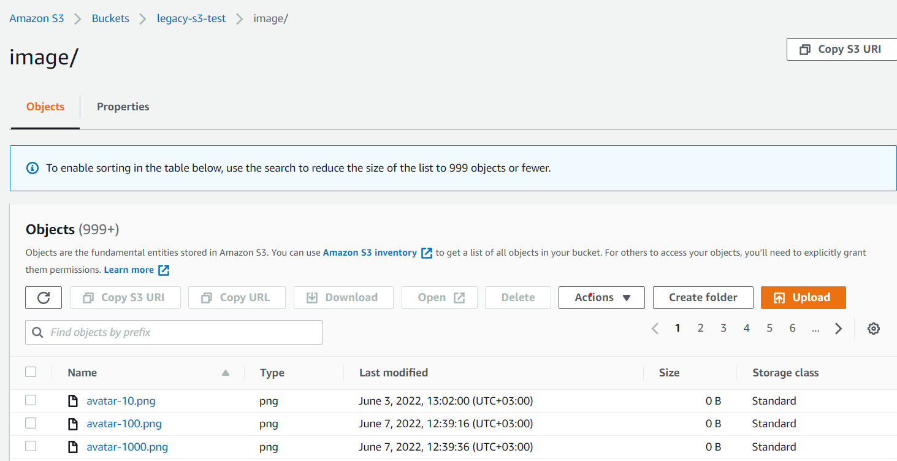
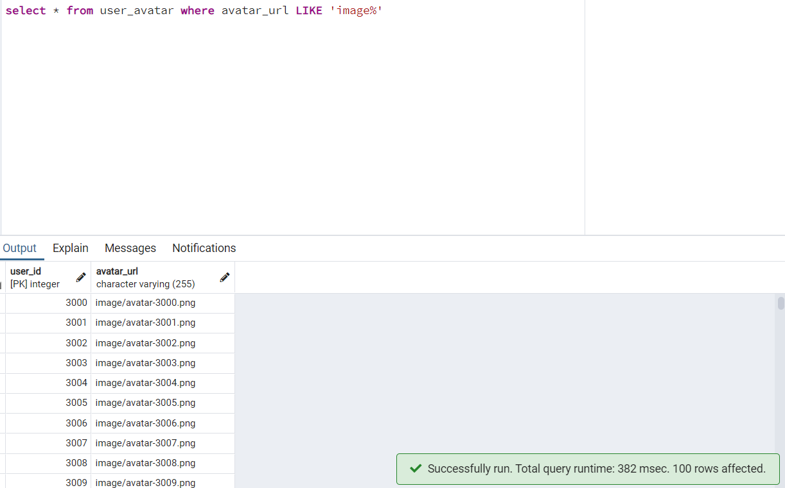
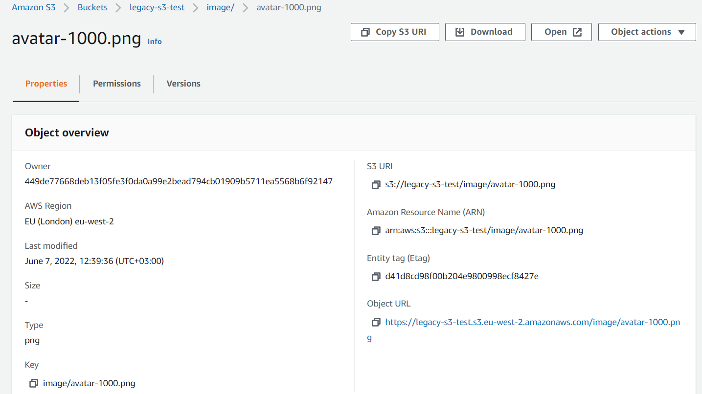
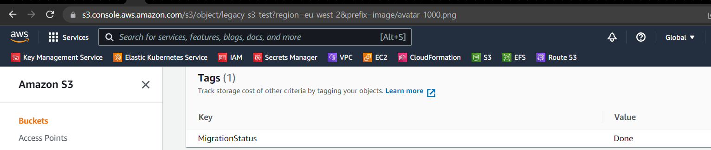
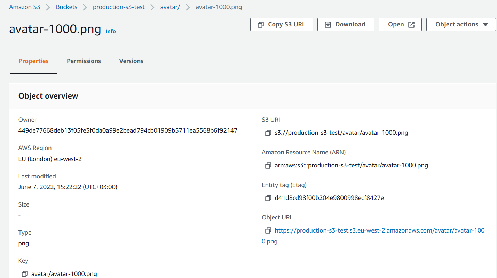
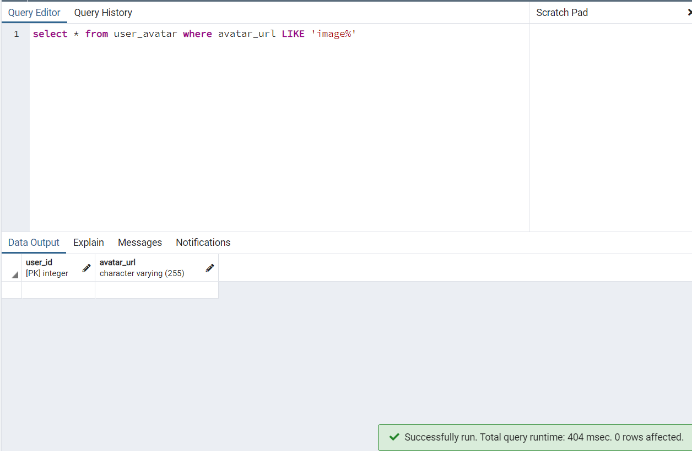

# bucket-migration
<!-- START doctoc generated TOC please keep comment here to allow auto update -->
<!-- DON'T EDIT THIS SECTION, INSTEAD RE-RUN doctoc TO UPDATE -->
**Table of Contents**  *generated with [DocToc](https://github.com/thlorenz/doctoc)*
- [bucket-migration](#bucket-migration)
  - [Repository description](#repository-description)
  - [Setup prerequisites](#setup-prerequisites)
  - [How to use](#how-to-use)
    - [Migration script](#migration-script)
    - [Command to execute](#command-to-execute)
    - [Command to execute the unit tests](#command-to-execute-the-unit-tests)
  - [How to create test data](#how-to-create-test-data)
    - [Usage](#usage)
  - [Example of execution](#example-of-execution)
    - [Test data creation](#test-data-creation)
      - [Command execution log](#command-execution-log)
      - [[Screenshot] AWS S3 legacy-s3-test bucket before migration](#screenshot-aws-s3-legacy-s3-test-bucket-before-migration)
      - [[Screenshot] Postgres DB query before migration](#screenshot-postgres-db-query-before-migration)
    - [Migration](#migration)
      - [Command execution log for 500 entries](#command-execution-log-for-500-entries)
      - [Command execution log for 2000 entries](#command-execution-log-for-2000-entries)
      - [[Screenshot] AWS S3 legacy-s3-test bucket migration result](#screenshot-aws-s3-legacy-s3-test-bucket-migration-result)
      - [[Screenshot] AWS S3 production-s3-test bucket migration result](#screenshot-aws-s3-production-s3-test-bucket-migration-result)
      - [[Screenshot] Postgres DB query migration result](#screenshot-postgres-db-query-migration-result)

<!-- END doctoc generated TOC please keep comment here to allow auto update -->
## Repository description
Bucket-migration is a repository that perform the following:
- copies the content of a bucket to another 
    - based on the parameters set in constants.py it copies from an old bucket and its prefix to a new bucket and its prefix
- updates a column content from a Postgres DB
    - updates the rows of the avatar_url column from image to avatar

##  Setup prerequisites
1. Create the following resources in AWS
    - 2 AWS S3 Bucket, one containing the prefix __image__, and the other __avatar__
    - 1 Postgres DB containing 2 tables: __users__ and __user_avatar__
   ```
    CREATE TABLE users (
	    user_id serial PRIMARY KEY,
	    username VARCHAR ( 50 ) UNIQUE NOT NULL,
	    password VARCHAR ( 50 ) NOT NULL);
   CREATE TABLE user_avatar (
        user_id INT NOT NULL,
        avatar_url VARCHAR (255) UNIQUE NOT NULL,
        PRIMARY KEY (user_id),
        FOREIGN KEY (user_id)
        REFERENCES users (user_id));
   ```
    - 1 Amazon Linux EC2 instance. This instance comes with _awscli_, _python3_ and _pip3_ preinstalled
1. Install the requirements listed in __requirements.txt__: <br />
```bash 
pip3 install -r requirements.txt
```
2. Set up AWS credentials (in e.g. ~/.aws/credentials):<br />
```bash
aws configure set aws_access_key_id "$aws_access_id" --profile $profile
aws configure set aws_secret_access_key "$aws_secret" --profile $profile 
aws configure set region "$aws_region" --profile $profile
export AWS_PROFILE=$profile
```
3. Create .env file in source folder and add the PG DB Connection details
```text
PG_HOST=<postgres hostname>
PG_PORT=<postgres port>
PG_USER=<postgres database user>
PG_PASSWORD=<postgres database password>
PG_DATABASE=<database>
```

## How to use
Set up the buckets details and PG table details in the source/constants.py file.
```text
# Setup source and destination bucket details
OLD_BUCKET = "legacy-s3-test"
OLD_BUCKET_PREFIX = "image"
NEW_BUCKET = "production-s3-test"
NEW_BUCKET_PREFIX = "avatar"

# PG DB Table Details
TABLE_NAME = "user_avatar"
COLUMN_NAME = "avatar_url"
```
### Migration script
The main script is used to do the following:
- copies the content of the legacy-s3-test bucket to the production-s3-test bucket
    - checks if the png_keep_file.txt contains an empty array
    - if the above is true, it fetches all the keys from legacy-s3-test/image and writes the list in a file
    - if above is false, it means that a previous execution was interrupted, and it will continue to copy the remaining keys from the file
    - checks if the keys have the MigrationStatus and if it's set to Done
    - if above is true, it skips the copy, if yes it copies the file to the new bucket, it sets the MigrationStatus to Done in the old bucket and removes the entry from the png_keep_file.txt
    
- updates the images paths to the new one
    - connects to the PG DB
    - checks if there are paths with __image__ and updates it to __avatar__
    - closes the PG DB connection
    
### Command to execute    
```bash
cd <PATH>/bucket-migration/source
python3 main.py
```

### Command to execute the unit tests
The unit tests only performs a test on the functions created to execute the migration.
```bash
cd <PATH>/bucket-migration/source
pytest test
```

## How to create test data
This script was created to ease the creation of test data.
Assuming the legacy-s3-test bucket and Postgres DB are created the script will populat each resource with test data.

### Usage
1. Create a folder where you want to create/store the .png files

2. Add the path for the above created folder and png file details in `util/constans.py`
```text
# Set up the test data
DATA_FILES_LOCATION = "/home/ec2-user/avatar"
FILE_NAME = "/avatar*.png"
# Minimum number to have the avatar.png file in its name
MIN_RANGE = 1000 
# Maximum number to have the avatar.png file in its name
MAX_RANGE = 2000
```

3. Execute command:
```bash
cd <PATH>/bucket-migration/source
python3 test_data_setup.py
```

## Example of execution

### Test data creation
#### Command execution log
```text
[ec2-user@ip-172-31-2-85 source]$ python3 test_data_setup.py
[2022.06.06-15:28:54] [INFO] (credentials.py:1313): Found credentials in shared credentials file: ~/.aws/credentials
[2022.06.06-15:28:54] [INFO] (postgres.py:41): Closing PostgreSQL connection.
[2022.06.06-15:29:13] [INFO] (s3.py:170): All .png files were uploaded successfully.
```
#### [Screenshot] AWS S3 legacy-s3-test bucket before migration
***

#### [Screenshot] Postgres DB query before migration
***


### Migration
#### Command execution log for 500 entries
```text
[2022.06.06-15:30:03] [INFO] (s3.py:122): Starting copy from bucket legacy-s3-test to bucket production-s3-test
[2022.06.06-15:30:04] [INFO] (s3.py:127): Remaining files to copy: 500
[2022.06.06-15:30:04] [INFO] (s3.py:135): Initiating copy of the object: image/avatar-1000.png
[2022.06.06-15:30:04] [INFO] (s3.py:142): image/avatar-1000.png object was successfully migrated to avatar/avatar-1000.png
[.....]
[2022.06.06-15:31:27] [INFO] (postgres.py:65): There were found 500 avatar entry with image URL.
 Updating URLs...
[2022.06.06-15:31:27] [INFO] (postgres.py:70): Records Updated successfully.
[2022.06.06-15:31:27] [INFO] (postgres.py:41): Closing PostgreSQL connection.
```
#### Command execution log for 2000 entries
```text
[2022.06.06-15:41:01] [INFO] (s3.py:122): Starting copy from bucket legacy-s3-test to bucket production-s3-test
[......]
[2022.06.06-15:45:47] [INFO] (s3.py:127): Remaining files to copy: 60
[2022.06.06-15:45:47] [INFO] (s3.py:135): Initiating copy of the object: image/avatar-2700.png
[2022.06.06-15:45:47] [INFO] (s3.py:142): image/avatar-2700.png object was successfully migrated to avatar/avatar-2700.png
[2022.06.06-15:45:47] [INFO] (s3.py:68): Migration successful status was set for object:  image/avatar-2700.png
[2022.06.06-15:45:47] [INFO] (s3.py:145): image/avatar-2700.png was removed from migration list.
[2022.06.06-15:45:47] [INFO] (s3.py:127): Remaining files to copy: 59
[2022.06.06-15:45:47] [INFO] (s3.py:135): Initiating copy of the object: image/avatar-2759.png
[2022.06.06-15:45:47] [INFO] (s3.py:142): image/avatar-2759.png object was successfully migrated to avatar/avatar-2759.png
[2022.06.06-15:45:47] [INFO] (s3.py:68): Migration successful status was set for object:  image/avatar-2759.png
[......]
[2022.06.06-15:45:53] [INFO] (postgres.py:65): There were found 2000 avatar entry with image URL.
 Updating URLs...
[2022.06.06-15:45:53] [INFO] (postgres.py:70): Records Updated successfully.
[2022.06.06-15:45:53] [INFO] (postgres.py:41): Closing PostgreSQL connection.
```
#### [Screenshot] AWS S3 legacy-s3-test bucket migration result
***


#### [Screenshot] AWS S3 production-s3-test bucket migration result
***

#### [Screenshot] Postgres DB query migration result
***

